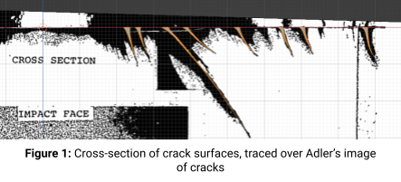
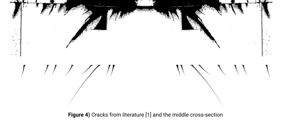
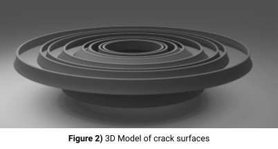
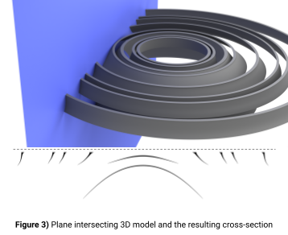
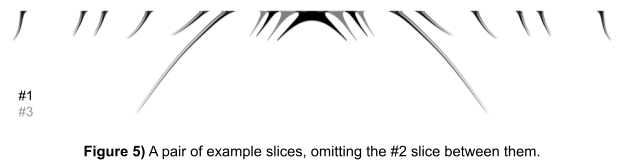
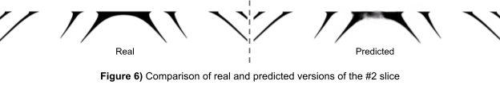
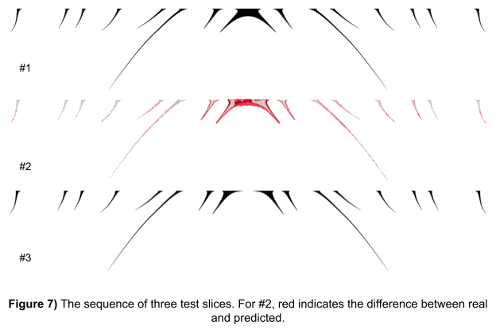

A collection of my projects working for the Computational Multiscale Mechanics Lab at VCU

# Open source highly parallel peridynamic simulation written in Julia

I created an open source peridynamic implementation that is easy to install and modify and can run on supercomputers and desktop.

Our lab was using an incredibly buggy, monolithic, untested, legacy peridynamic code written in FORTRAN. There are even some parts written in FORTRAN 77 where comment lines start with the letter ‘c’! So I decided to write my own, open source, peridynamic simulation that could run on a high performance compute cluster, a desktop, and even in a REPL. It helped be become very familiar with peridynamics, it gave the lab a more efficient, tested, and cleaner simulation, and it gave me lots of experience with software development, and since my research is part of USCOMP, a NASA Space Technology Research Institute that is part of the materials genome initiative, developing open source tools was encouraged.

I made prototypes in several different languages. Python, C++, and ended up staying with Julia. Our lab is in a mechanical and nuclear engineering department and my advisor has trouble getting grad students who know how to program, so C++ was ruled out because it has a lot of low level concepts that would be hard for beginners. Visualizing data and installing libraries in C++ was also a pretty painful process compared to in Python or Julia. Python was not used because it was too slow and a lot of the features that could be used to make it faster (numba, pyopencl, etc) either added a lot of complexity to the code or had trouble parallelizing custom data structures.

Julia has so far been an excellent choice in programming language. It has a high level syntax, has multidimensional arrays built into the language, is incredibly easy to parallelize, and it also has the ability to call python code to couple with some of our existing scripts.

I learned a surprising amount about software development and how to structure code in a very agnostic way.

 [https://github.com/CMSM-VCU/CMSM-Moa/](https://github.com/CMSM-VCU/CMSM-Moa/)

All of the simulations of the hexagonal bundles and multi-bundle networks were using this software.

# Computer Vision

#### Non Collapsed CNT recognition

Using a combination of morphological filters, thresholding, and contrast correction, I created a method to identify non-collapsed carbon nanotubes in TEM images.

#### Collapsed CNT recognition

I created a convolutional neural network to identify collapsed carbon nanotubes in TEM images.

In a CNT composite, identifying the volume fraction of collapsed carbon nanotubes could be key in identifying ways to improve it.

It was incredibly difficult to identify collapsed carbon nanotubes in these images because the there isn’t really a difference in density between the graphene, amorphous carbon, and the semi-ordered carbon that is all throughout the image. I tried several analytical methods in an attempt to isolate the collapsed CNTs, but couldn’t get anything to work well. Which is why I turned to machine learning.

The training data for this network was created by hand labeling an image of where all of the collapsed CNTs were. Several images were created from the original image by randomly rotating, reflecting, and cropping a smaller image. They were simply labeled by whether or not the same random sampling in the hand labeled image had a collapsed CNT or not.

My network only evaluates a small 32x32 image as it’s input. So to apply it to a larger image. The network’s prediction is convolved over the entire image and each pixel in the large image averages the results it gets. This average is then be thesholded to get a binary classification of each pixel.

This image shows non-collapsed CNTs in teal, collapsed CNT dumbbells in yellow, contiguous parallel collapsed CNT walls in red, and everything that was not identified by the neural network as collapsed CNTs:

# Multiscale CNT Modeling

This multiscale method looks at Molecular Dynamics simulations and simplifies them so their complexity remains feasibly computable. The three levels modeled are:

1. Atomic
2. CNT Bundle
3. CNT Bundle Network

### Novel quasi-static tensile testing method

Implemented in my open source peridynamic program. This method is necessary because of the timescales involved in normal peridynamic models. Peridynamics is normally used for impacts and fracture mechanics with a very small timestep, so the number of timesteps needed to compute a tensile test without massive strain rates is not reasonable. This method attempts to do so by finding an equilibrium via adaptive dynamic relaxation. However, this technique is usually meant for finite element and does not handle elements breaking, or effectively disappearing.

This technique avoids this by breaking bonds outside of the iterative loop after the system relaxes, then relaxes the system again. The result allows for a 

Another technique I implemented to speed this up is to apply a uniform strain to the system instead of simply displacing the tabs. If using a linear force response in a homogeneous material, this directly computes the relaxed position, any differences from non-linearity in force response, differences in materials, or asymmetric geometry are corrected by the relaxation step.

#### Custom bonding configuration

### MD force parameterization

Transforming the molecular dynamics simulation into a larger, easier to compute, peridynamic grid involved:

Creating a model

Parameterizing the force response

### Composite Microstructure
#### Microstructure geometry creation

#### Composite microstructure mechanical tests

Testing the 

### CNT Bundle
#### Complex CNT Bundle Generation

It’s important to create a peridynamic grid that does not have intersecting points but still has the underlying features of a carbon nanotube bundle. These are the results of some of my experiments in creating such a grid.

Cool visualizations I made in blender of a CNT bundle:

Modified the previous bundle to have a twist:

A large, multi bundle structure with strings that split, merge, and form entanglements with each other:

A CNT bundle network. Each string of points here represents a single bundle

#### CNT Bundle Tensile Tests

### CNT Multibundle Network

Using my open source implementation of peridynamics

### Hexagonal CNT Bundle
#### Periodic geometry generation

This process was used to create periodic CNT bundles 

#### Hexagonal Bundle Tensile Tests

From left to right, these gifs show, horizontal displacement, interface failure, CNT failure

Interface failure mode

Mixed failure mode

CNT failure mode

CNT Bundle force response

# Hypersonic Water Droplet

Created 3D reconstruction of a 2D simulation of a water droplet deforming due to a hypersonic boundary layer. This structure is being used to perform peridynamic impact tests.

# Custom Visualization

Wrote code to efficiently visualize point clouds

Concave hull

Concave hull generated from a ball-pivoting algorithm over a peridynamic point cloud

# 2D Crack viewer

# Neural network to interpolate sparse data

The goal of this project is to aid in our research of fracture mechanics by reconstructing cracks from sparse image slices. These fractures create distinct, somewhat continuous shapes in the material. The material remains intact and the cracks do not open, making them difficult to observe. A dye penetrant is applied that seeps into the cracks and highlights the cracks with a contrasting color. The three-dimensional shape of the cracks is visualized using a serial sectioning process. This consists of a repeating cycle of grinding away some material from the cross section and imaging it. This is roughly illustrated on the right. 

The grinding process is slow and labor-intensive, so the number of slices that can be imaged is relatively low. Relative to the resolution of the images, the slice spacing is extremely coarse and likely inconsistent. Producing a 3D reconstruction from this is possible, but the dramatically non-uniform resolution would make the reconstruction difficult to use.

We use a convolutional neural network to predict what slices are between the few we do have. The training data was created by making a 3D model of a crack surface and rendering slices of it in blender.

